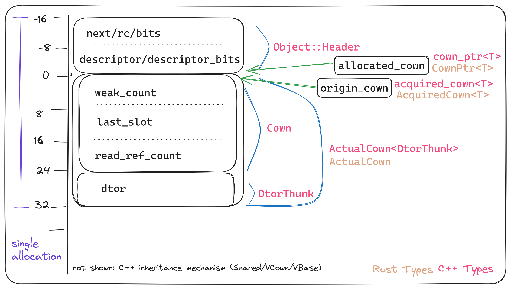
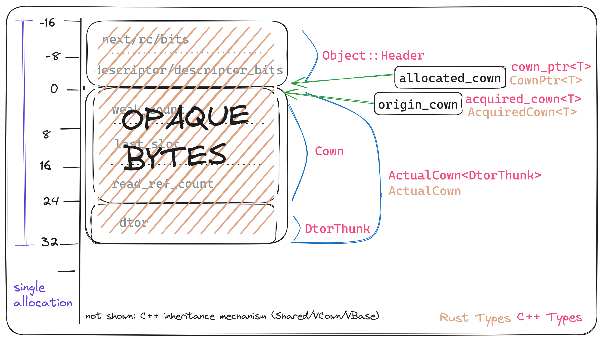

## What do we want to do here?

- BoC concurrency in Rust.
- With the existing verona-rt implementation.

## Current Status

- Cowns work
- `when` works
    - Only 1 & 2 Cowns
- On crates.io today
- Lots to do:
    - Atomically scheduling multiple behaviours
    - Schedule across any number of cowns.
    - Tests & Benchmarks

##

```rust
let string = CownPtr::new(String::new());
let vec = CownPtr::new(Vec::<i32>::new());
when(&string, |mut s| {
    assert_eq!(&*s, "");
    s.push_str("foo");
});
when(&vec, |mut v| {
    assert_eq!(&*v, &[]);
    v.push(101);
});
when2(&string, &vec, |mut s, mut v| {
    assert_eq!(&*s, "foo");
    assert_eq!(&*v, &[101]);
    s.push_str("bar");
    v.push(666);
});
when(&string, |s| assert_eq!(&*s, "foobar"));
when(&vec, |v| assert_eq!(&*v, &[101, 666]));
```

##

```cpp
auto string = make_cown<std::string>();
auto vec = make_cown<std::vector<int>>();
when(string) << [](auto s) {
    assert(*s == "");
    s->append("foo");
};
when(vec) << [](auto v) {
    assert(v->size() == 0);
    v->push_back(101);
};
when(string, vec) << [](auto s, auto v) {
    assert(*s == "foo");
    assert(*v == std::vector{101});
    s->append("bar");
    v->push_back(666);
};
when(string) << [](auto s) { assert(*s == "foobar"); };
when(vec) << [](auto v) { assert((*v == std::vector{101, 666})); }
```


##

```cpp
auto string = make_cown<std::string>();
auto vec = make_cown<std::vector<int>>();
when( string) << [](auto s) {
    assert    ( *s == "");
    s->append ("foo");
};
when( vec) << [](auto v) {
    assert   (v->size() == 0);
    v->push_back(101);
};
when ( string,  vec) << [](auto s, auto v) {
    assert    ( *s == "foo");
    assert    ( *v == std::vector{101});
    s->append ("bar");
    v->push_back(666);
};
when( string) << [](auto s) { assert    ( *s == "foobar"); };
when( vec) << [](auto v) { assert    ((*v == std::vector{101, 666})); };
```

## 

```rust
let  string = CownPtr::new(String::new());
let  vec = CownPtr::new(Vec::<i32>::new());
when(&string,       |mut s| {
    assert_eq!(&*s,   "");
    s.push_str("foo");
});
when(&vec,       |mut v| {
    assert_eq!(&*v, &[]);
    v.push      (101);
});
when2(&string, &vec,       |mut s,  mut v| {
    assert_eq!(&*s,   "foo");
    assert_eq!(&*v,             &[101]);
    s.push_str("bar");
    v.push      (666);
});
when(&string,           |s|   assert_eq!(&*s,   "foobar"));
when(&vec,           |v|   assert_eq!(&*v,             &[101, 666]));
```

## Design Decisions

- Reuse C++ `verona-rt`
    - Write bindings, don't port
- Do all allocations and reference counting in C++

##
.png)

##


##


##
.png)

## Rust Side Representation

```rust
#[repr(C)]
struct ActualCown {
    _marker: MaybeUninit<[*const (); 4]>,
}
#[repr(C)]
struct CownDataToxic<T> {
    cown: ActualCown, // Must be first, so we can cast pointers
    data: T,
}

struct CownPtr<T> {
    cown_ptr: *mut (),
    _marker: PhantomData<T>,
}
```


## New C++ API

```cpp
typedef void (*dtor)(void *);

class DtorThunk {
  dtor dtor_;
  DtorThunk(dtor dtor) : dtor_(dtor) {}
  ~DtorThunk();
};

cown_ptr<DtorThunk> make_boxcar_cown(size_t size, dtor dtor) {
  ActualCown<DtorThunk> *ptr = new (size) ActualCown<DtorThunk>(dtor);
  return cown_ptr<DtorThunk>(ptr);
}
```

## New Allocation Methods

```cpp
template <class T> class VCown : public VBase<T, Cown> {
  // Original
  void *operator new(size_t) {
    return Object::register_object(ThreadAlloc::get().alloc<vsizeof<T>>(),
                                   VBase<T, Cown>::desc());
  }

  // My new thing
  void *operator new(size_t base_size, size_t req_size) {
    assert(req_size >= base_size);
    return Object::register_object(ThreadAlloc::get().alloc(req_size),
                                   VBase<T, Cown>::desc());
  }
};
```

## Rust Side Construction

```rust

impl<T> CownPtr<T> {
  const ALLOCATION_SIZE: usize = vsizeof::<CownDataToxic<T>>();

  pub fn new(value: T) -> Self {
     unsafe {
        let mut cown_ptr = mem::zeroed();
        ffi::boxcar_cownptr_new(
            Self::ALLOCATION_SIZE,
            drop_glue::<T>,
            &mut cown_ptr
        );
        let this = Self { cown_ptr, _marker: PhantomData};
        ptr::write(this.data_ptr(), value);
        this
     }
  }
}
```

## Questions?

- Does this make sense?
- How much of this is generalizable?
- How to go about upstreaming?

## Links

- Source: [github.com/aDotInTheVoid/boxcars](https://github.com/aDotInTheVoid/boxcars)
- Email: [alona.enraght-moony21@imperial.ac.uk](mailto:alona.enraght-moony21@imperial.ac.uk)