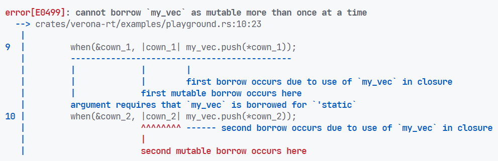
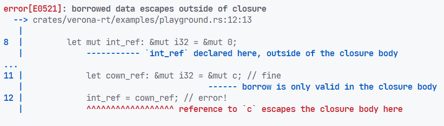
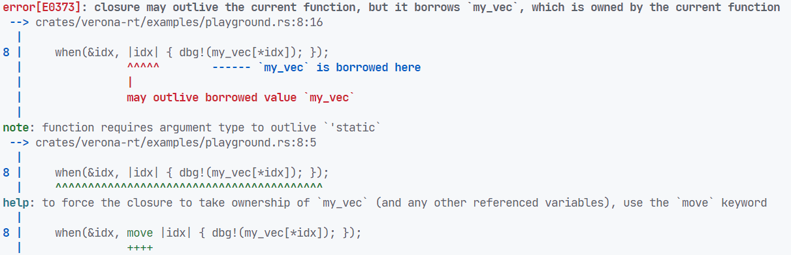
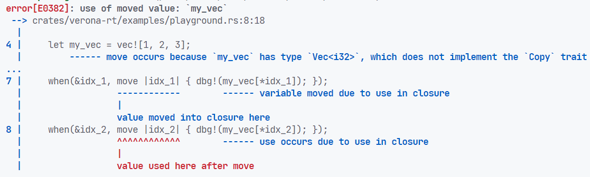

# Background: Behaviour Oriented Concurreny

## Behaviour Oriented Concurreny

- Cowns: Store and guard access to data.
- Behaviours: Unit of computation that acts on cowns. 


## BoC: Cowns

A cowns is a containerer for some data:

```scala
var my_cown: Cown[int] = Cown.create(10);
```

## BoC: Behaviours

Behaviours acquire a cown, and allow access to it's data:

```scala
var my_cown: Cown[int] = Cown.create(10);

when (my_cown) {
    // <1>: This block executed when my_cown acquired
    my_cown += 1;
}

// This may (or may not) happen before <1>.
print("Spawned a behaviour"); 
```

Cowns can only be acquired by one behaviour at a time.

## BoC: Behaviours with multiple cowns

```scala
let a = Cown.create("hello");
let b = Cown.create("World");

when (a) {
    print(a); // <1>
}
when (b) {
    print(b); // <2>: May happen before or after <1>
}
when (a, b) {
    print(a, b); // Guaranteed run after <1> and <2>
}
```

A behaviour $b_1$ is gaurenteed to be executed before $b_2$ if and only if $b_1$ and $b_2$ acquire overlapping cowns and
$b_1$ was spawned before $b_2$.

## BoC: Gaurentees

- datarace-free!
    - all shared state is in cowns
    - executing behaviours have
    - behaviours 
- deadlock-free!
    - 


## What BoC needs from a host language

BoC 

- Ensure cown's data isn't reachable by other means
- Ensure behaviours 

# Background: Rust

## Rust

- Systems Programming Language
- Type Safe
- Memory Safe
- Data-Race-Freedom

## Rust: Ownership

1. Each value in Rust has an owner.
2. There can only be one owner at a time for a value, but it can be transfered between owners.
3. When the owner goes out of scope, the value is dropped

## Rust: Borrowing

Values can be borrowed in 2 way:

1. Mutable/exclusive reference:
   - `&mut i32`
   - Can only be 1 mutable referece to a value at a time.
   - Allows mutation.
2. Immutable/shared reference:
    - `&i32`
    - Can be many at a time, but not if there's also a mutable reference.
    - Doesn't allow mutation ^†^

More succinctly, references allow **Aliasing XOR Mutation**.

Enforced by a part of the compiller called the **Borrow Checker**.


## Rust: Lifetimes

```rust
fn select_ref(which: bool, when: &i32, unless: &i32) -> &i32 {
    if which {
        when
    } else {
        unless
    }
}
```

<!-- TODO: Error?? -->

## Rust: Lifetimes

```rust
fn select_ref<'a>(which: bool, when: &'a i32, unless: &'a i32) -> &'a i32 {
    if which {
        when
    } else {
        unless
    }
}
```

## Rust: `std::sync::Mutex`

```rust
struct Mutex<T> { /* private fields */ }

impl<T> Mutex<T> {
    pub fn lock<'a>(&self) -> LockResult<MutexGuard<'a, T>>;
}

struct MutexGuard<'a, T: 'a> { /* private fields */ }

impl<T: ?Sized> Deref for MutexGuard<'_, T> {
    type Target = T;

    fn deref(&self) -> &T {
        unsafe { &*self.lock.data.get() }
    }
}
```

## Rust: Closures

```rust
let x: i32 = 10;
let add_x = |y: i32| x + y;
dbg!(add_x(3)); // [src/main.rs:8:5] add_x(3) = 13
```

## Rust: Closure Desugaring

```rust
struct _AddXClosure {
    captured_x: i32,
}

impl core::ops::Fn<(i32,)> for _AddXClosure {
    type Output = i32;
    
    extern "rust-call" fn call(&self, (y,): (i32,)) -> i32 {
        self.captured_x + y
    }
}

let x = 10;
let add_x = _AddXClosure { captured_x: x };
dbg!(add_x.call((3,))); // [src/main.rs:12:5] add_x.call((3,)) = 13
```


## Rust: `Fn`, `FnMut` and `FnOnce`

- `Fn`: Takes captures by shared reference (`&self`)
- `FnMut`: Takes captures by exclusive reference (`&mut self`)
- `FnOnce`: Takes captures by value (`self`)

`Fn` implies `FnMut`, and `FnMut` implies `FnOnce`

## Rust: `unsafe`

- `unsafe` is used to build safe abstractions like `Mutex`, `Vec` and `Thread`
- Lets you:
    1. Call `unsafe` methods
    2. Dereference raw pointers
    3. Implement an `unsafe` trait.
- Allows bypassing gaurentees that the compiller normally ensures

```rust
unsafe fn transmute<Src, Dst>(src: Src) -> Dst { /**/ }
unsafe trait Send { }
```

# Background: `verona-rt`

## `verona-rt`

- C++ implementatation of BoC
- 2 API's:
    - `verona::rt`,
    - `verona::cpp`, a C++ DSL to write BoC code in C++

## Using `verona-rt::cpp`

```c++
auto f = verona::cpp::make_cown<std::string>("hello");

verona::cpp::when(f) << [](auto f) {
    f->push_back('!');
    std::cout << *f << '\n';
};
```

## Data-race in `verona-rt::cpp`.

```c++
cown_ptr<int> my_cown = make_cown<int>(10);
int* escape_data;
when(my_cown) << [&escape_data](acquired_cown<int> my_cown) {
    escape_data = &*my_cown;
};
sleep(3); // Wait for behaviour to run
*escape_data += 10; // Modifies cown without acquiring!!!
```


## Data-race in `verona-rt::cpp`.

```cpp
std::vector<int> my_vec{};
auto cown1 = make_cown<int>(42);
auto cown2 = make_cown<int>(12);

when(cown1) << [&my_vec](auto cown1) {
    for (int i = 0; i < 1000; i++)
        my_vec.push_back(*cown1);
};

when(cown2) << [&my_vec](auto cown2) {
    for (int i = 0; i < 1000; i++)
        my_vec.push_back(*cown2);
};

when(cown1, cown2) << [&my_vec](auto cown1, auto cown2) {
    for (int& i : my_vec)
        std::cout << i << "\n";
};
```

# Boxcars

## Boxcars: Hello World

```rust
let cown = boxcars::Cown::new(String::from("Hello, World"));

boxcars::when(&cown, |mut acq_cown: boxcars::AcquiredCown<String>| {
    acq_cown.push('!');
    println!("{}", *acq_cown);
});
```

## Boxcars: Multiple Cowns

```rust
let a = Cown::new(3);
let b = Cown::new(5);

when(&a, |mut a| *a += 10);
when(&b, |mut b| *b += 10);

when((&a, &b), |(a, b)| {
    // [examples/playground.rs:12:13] a = 13
    // [examples/playground.rs:12:13] b = 15
    dbg!(a, b);
});
```

## Boxcars: Cown API

```rust
pub struct Cown<T> { /* private fields */ }
impl<T> Cown<T> {
    pub fn new(value: T) -> Cown<T> { ... }
}


pub struct AcquiredCown<'a, T> { /* private fields */ }
impl<'a, T> std::ops::Deref for AcquiredCown<'a, T> {
    type Target = T;
    fn deref(&self) -> &Self::Target { ... }
}
impl<'a, T> std::ops::DerefMut for AcquiredCown<'a, T> { ... }
```

## Boxcars: API

```rust
pub fn when<C, F>(cowns: C, func: F)
where
    C: CownCollection,
    F: for<'a> FnOnce(C::Acquired<'a>) + 'static {}

pub trait CownCollection {
    type Acquired<'a>;
}

impl<A: 'static> CownCollection for &Cown<A> {
    type Acquired<'a> = AcquiredCown<'a, A>
}
impl<A: 'static, B: 'static> CownCollection for (&Cown<A>, &Cown<B>) {
    type Acquired<'a> = (AcquiredCown<'a, A>, AcquiredCown<'a, B>)
}
```

## Error Prevented: Aliasing Captures

```rust
let mut my_vec = Vec::<i32>::new();
let cown_1 = Cown::new(10);
let cown_2 = Cown::new(20);

when(&cown_1, |cown_1| my_vec.push(*cown_1));
when(&cown_2, |cown_2| my_vec.push(*cown_2));
```



## Error Prevented: Escaping the Reference

```rust
let c = Cown::new(10);
let mut int_ref: &mut i32 = &mut 0;

when(&c, move |mut c| {
    let cown_ref: &mut i32 = &mut c; // fine
    int_ref = cown_ref; // error!
});
```



## Error Prevented: Borrowing off stack

```rust
fn borrow_from_stack() {
    let my_vec = vec![1, 2, 3];
    let idx = Cown::new(1);
    when(&idx, |idx| { dbg!(my_vec[*idx]); });
}
```



## Safely Borrowing off stack

```rust
fn borrow_from_stack() {
    let my_vec = vec![1, 2, 3];
    let idx = Cown::new(1);
    when(&idx, move |idx| {
        // [examples/playground.rs:7:9] my_vec[*idx] = 2
        dbg!(my_vec[*idx]);
    });
}
```

## Error Prevented: Capturing Twice

```rust
let my_vec = vec![1, 2, 3];
let idx_1 = Cown::new(1);
let idx_2 = Cown::new(2);
when(&idx_1, move |idx_1| { dbg!(my_vec[*idx_1]); });
when(&idx_2, move |idx_2| { dbg!(my_vec[*idx_2]); });
```




## Boxcars: C++ FFI

- Rust can make FFI calls to C, but not C++
- Rust can't cause C++ template instantiation
    - All 

## Boxcars: Layered design

1. `verona::rt`
2. `boxcars_*` C++ binding functions
3. unsafe `boxcars` internals
4. safe `boxcars` user-facing API.

## Boxcars: Cown API

```rust
struct Cown<T> { /**/ }

impl<T> Cown<T> {
    fn new(value: T) -> Self { /**/ }
}
```

## Cown Layout


## Cown Creation

```rust
verona::rt::Cown* boxcars_allocate_cown(verona::rt::Cown* desc)
```

## Cown Lifecycle

```rust
impl<T> std::clone::Clone for Cown<T> {
    fn clone(&self) -> Self {
        unsafe { ffi::boxcars_acquire_object(self.cown_ptr) }
        Self { cown_ptr: self.cown_ptr }
    }
}
impl<T> std::ops::Drop for Cown<T> {
    fn drop(&mut self) {
        unsafe { ffi::boxcars_release_object(self.cown_ptr) };
    }
}
```


# Benchmarks

## Benchmarks: Create Cowns


## Benchmarks: Schedule Behaviours


## Future Work

- BoC extensions:
    - Read-only acquired cowns
    - Atomic scheduling of multiple behaviours
    - 