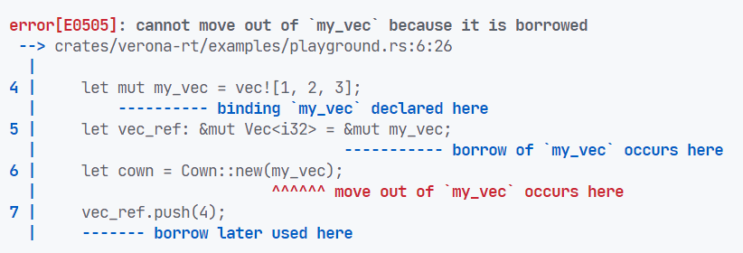

# Background: Behaviour Oriented Concurreny

## Behaviour Oriented Concurreny

- Cowns: Store and guard access to data.
- Behaviours: Unit of computation that acts on cowns. 


## BoC: Cowns

A cowns is a containerer for some data:

```scala
var my_cown: Cown[int] = Cown.create(10);
```

## BoC: Behaviours

Behaviours acquire a cown, and allow access to it's data:

```scala
var my_cown: Cown[int] = Cown.create(10);

when (my_cown) {
    // <1>: This block executed when my_cown acquired
    my_cown += 1;
}

// This may (or may not) happen before <1>.
print("Spawned a behaviour"); 
```

Cowns can only be acquired by one behaviour at a time.

## BoC: Behaviours with multiple cowns

```scala
let a = Cown.create("hello");
let b = Cown.create("World");

when (a) {
    print(a); // <1>
}
when (b) {
    print(b); // <2>: May happen before or after <1>
}
when (a, b) {
    print(a, b); // Guaranteed run after <1> and <2>
}
```

A behaviour $b_1$ is guaranteed to be executed before $b_2$ if and only if $b_1$ and $b_2$ acquire overlapping cowns and
$b_1$ was spawned before $b_2$.

## BoC: Guarantees

- datarace-free!
    - behaviours are only way to execute code in parallel
    - all shared state is in cowns
    - behaviours ensure unique access to cowns before executing
- deadlock-free!
    - only "blocking" operation is acquiring cowns when spawning behaviour
    - but this lets next statement execute
    - all cowns acquired at once, avoids lock-inversion

## What BoC needs from a host language

BoC can be implemented as an library/extension to existing languages.

However, to get datarace and deadlock freedom, host languages must:

- Ensure cown's data isn't reachable by other means
- Ensure behaviours only access shared data via cowns


# Background: `verona-rt`

## `verona-rt`

- C++ implementation of BoC
- 2 API's:
    - `verona::rt`,
    - `verona::cpp`, a C++ DSL to write BoC code in C++

## Using `verona-rt::cpp`

```c++
using namespace verona::cpp;

cown_ptr<std::string> cown = make_cown<std::string>("hello");

when(cown) << [](acquired_cown<std::sting> cown) {
    cown->push_back('!');
    std::cout << *cown << '\n';
};
```

Type system used to model BoC

- `cown_ptr<T>`: Forbids access
- `acquired_cown<T>`: Allows access

## Accessing Cown's Data Outside of Behaviour

```c++
cown_ptr<int> my_cown = make_cown<int>(10);
int* escape_data;
when(my_cown) << [&escape_data](acquired_cown<int> my_cown) {
    escape_data = &*my_cown;
};
sleep(3); // Wait for behaviour to run
*escape_data += 10; // Modifies cown without acquiring!!!
```

## Accessing Shared Data in Behaviours 

```cpp
std::vector<int> my_vec{};
auto cown1 = make_cown<int>(42);
auto cown2 = make_cown<int>(12);

when(cown1) << [&my_vec](auto cown1) {
    my_vec.push_back(*cown1);
};

when(cown2) << [&my_vec](auto cown2) {
    my_vec.push_back(*cown2);
};

when(cown1, cown2) << [&my_vec](auto cown1, auto cown2) {
    for (int& i : my_vec)
        std::cout << i << "\n";
};
```

# Background: Rust

## Rust

- Systems Programming Language
- Type Safe
- Memory Safe
- Data-Race-Freedom

## Rust: Ownership

1. Each value in Rust has an owner.
2. There can only be one owner at a time for a value, but it can be transferred between owners.
3. When the owner goes out of scope, the value is dropped

## Rust: Borrowing

Values can be borrowed in 2 way:

1. Mutable/exclusive reference:
   - `&mut i32`
   - Can only be 1 mutable reference to a value at a time.
   - Allows mutation.
2. Immutable/shared reference:
    - `&i32`
    - Can be many at a time, but not if there's also a mutable reference.
    - Doesn't allow mutation ^†^

More succinctly, references allow **Aliasing XOR Mutation**.

Enforced by a part of the compiler called the **Borrow Checker**.


## Rust: Lifetimes

```rust
fn select_ref(which: bool, when: &i32, unless: &i32) -> &i32 {
    if which {
        when
    } else {
        unless
    }
}
```

<!-- TODO: Error?? -->

## Rust: Lifetimes

```rust
fn select_ref<'a>(which: bool, when: &'a i32, unless: &'a i32) -> &'a i32 {
    if which {
        when
    } else {
        unless
    }
}
```

## Rust: `Mutex` API

```rust
pub struct Mutex<T> { ... }
pub struct MutexGuard<'a, T: 'a> { ... }
impl<T> Mutex<T> {
    pub fn lock<'a>(&'a self) -> MutexGuard<'a, T>;
}

impl<T> std::ops::DerefMut for MutexGuard<'_, T> {
    type Target = T;
    fn deref_mut(&mut self) -> &mut T { ... }
}
impl<T> std::ops::Drop for T { ... } 
```

- Mutex can only be accessed when locked.
- Mutex automatically unlocked when guard goes out of scope.
- Lifetime of `&mut T` given out tied to lifetime of guard.


## Rust: `unsafe`

```rust
struct MutexGuard<'a, T: 'a> { 
    // INV: self.lock is locked by us
    lock: &'a Mutex<T>
}
impl<T: ?Sized> std::ops::DerefMut for MutexGuard<'_, T> {
    type Target = T;
    fn deref_mut(&mut self) -> &mut T {
        // SAFETY: we hold the lock, so no-one else could access data
        unsafe { &mut *self.lock.data.get() }
    }
}
```

- `unsafe` blocks let you write code the compiler can't check upholds guarantees
- You have to uphold them yourself

## Rust: Closures

```rust
let x: i32 = 10;
let add_x = |y: i32| x + y;
dbg!(add_x(3)); // [src/main.rs:8:5] add_x(3) = 13
```

## Rust: Closure Desugaring

```rust
struct _AddXClosure {
    captured_x: i32, // no function-pointer!
}

impl core::ops::Fn<(i32,)> for _AddXClosure {
    type Output = i32;
    
    extern "rust-call" fn call(&self, (y,): (i32,)) -> i32 {
        self.captured_x + y
    }
}

let x = 10;
let add_x = _AddXClosure { captured_x: x };
dbg!(add_x.call((3,))); // [src/main.rs:12:5] add_x.call((3,)) = 13
```


## Rust: `Fn`, `FnMut` and `FnOnce`

- `Fn`: Takes captures by shared reference (`&self`)
- `FnMut`: Takes captures by exclusive reference (`&mut self`)
- `FnOnce`: Takes captures by value (`self`)

`Fn` implies `FnMut`, and `FnMut` implies `FnOnce`

# Boxcars

## Boxcars: Hello World

```rust
let cown = boxcars::Cown::new(String::from("Hello, World"));

boxcars::when(&cown, |mut acq_cown: boxcars::AcquiredCown<String>| {
    acq_cown.push('!');
    println!("{}", *acq_cown);
});
```

## Boxcars: Multiple Cowns

```rust
let a = Cown::new(3);
let b = Cown::new(5);

when(&a, |mut a| *a += 10);
when(&b, |mut b| *b += 10);

when((&a, &b), |(a, b)| {
    // [examples/playground.rs:12:13] a = 13
    // [examples/playground.rs:12:13] b = 15
    dbg!(a, b);
});
```

## Boxcars: Cown API

```rust
pub struct Cown<T> { /* private fields */ }
impl<T> Cown<T> {
    pub fn new(value: T) -> Cown<T> { ... }
}


pub struct AcquiredCown<'a, T> { /* private fields */ }
impl<'a, T> std::ops::Deref for AcquiredCown<'a, T> {
    type Target = T;
    fn deref(&self) -> &Self::Target { ... }
}
impl<'a, T> std::ops::DerefMut for AcquiredCown<'a, T> { ... }
```


## Error Prevented: Holding Reference to Object in Cown

```rust
let mut my_vec = vec![1, 2, 3];
let vec_ref: &mut Vec<i32> = &mut my_vec;
let cown = Cown::new(my_vec);
vec_ref.push(4);
```




## Boxcars: API

```rust
pub fn when<C, F>(cowns: C, func: F)
where
    C: CownCollection,
    F: for<'a> FnOnce(C::Acquired<'a>) + 'static {}

pub trait CownCollection {
    type Acquired<'a>;
}

impl<A: 'static> CownCollection for &Cown<A> {
    type Acquired<'a> = AcquiredCown<'a, A>
}
impl<A: 'static, B: 'static> CownCollection for (&Cown<A>, &Cown<B>) {
    type Acquired<'a> = (AcquiredCown<'a, A>, AcquiredCown<'a, B>)
}
```

## Error Prevented: Aliasing Captures

```rust
let mut my_vec = Vec::<i32>::new();
let cown_1 = Cown::new(10);
let cown_2 = Cown::new(20);

when(&cown_1, |cown_1| my_vec.push(*cown_1));
when(&cown_2, |cown_2| my_vec.push(*cown_2));
```


## Error Prevented: Escaping the Reference

```rust
let c = Cown::new(10);
let mut int_ref: &mut i32 = &mut 0;

when(&c, move |mut c| {
    let cown_ref: &mut i32 = &mut c; // fine
    int_ref = cown_ref; // error!
});
```


## Error Prevented: Borrowing off stack

```rust
fn borrow_from_stack() {
    let my_vec = vec![1, 2, 3];
    let idx = Cown::new(1);
    when(&idx, |idx| { dbg!(my_vec[*idx]); });
}
```


## Safely Borrowing off stack

```rust
fn borrow_from_stack() {
    let my_vec = vec![1, 2, 3];
    let idx = Cown::new(1);
    when(&idx, move |idx| {
        // [examples/playground.rs:7:9] my_vec[*idx] = 2
        dbg!(my_vec[*idx]);
    });
}
```

## Error Prevented: Capturing Twice

```rust
let my_vec = vec![1, 2, 3];
let idx_1 = Cown::new(1);
let idx_2 = Cown::new(2);
when(&idx_1, move |idx_1| { dbg!(my_vec[*idx_1]); });
when(&idx_2, move |idx_2| { dbg!(my_vec[*idx_2]); });
```


## Boxcars: C++ FFI

- Underlying `verona-rt` library relies extensively on templates
    - Every cown templated on the type it contains
    - Every behaviour templated on the closure it runs 
- Rust can make FFI calls to C, but not C++
- We choose what templates to instantiate once, without knowledge of user-defined types

## Boxcars: Layered design

1. `verona::rt`
    - Untyped `verona::rt::Cown`*
2. `boxcars_*` C++ binding functions
3. unsafe `boxcars` internals
4. safe `boxcars` user-facing API.
    - Typed `Cown<T>` and `AcquiredCown<T>`

## Cown Creation Dance

1. Rust: Find static pointer to descriptor
    
    This contains:

    - Destructor function pointer
    - Total allocation size
2. C++: Allocate object with that size
3. C++: Initialize non-type-specific parts:

    - Pointer to descriptor for destruction/inspection
    - Reference count
    - Scheduling state
4. Rust: Moves rust value into cown's allocation

```rust
verona::rt::Cown* boxcars_allocate_cown(verona::rt::Descriptor* desc)
```

## Cown Layout


## Cown Layout

- Rust-side knows:
    - `rt::Cown`/`rt::Object::Header` size
        - but not their contents!
    - `rt::Descriptor` size & contents
- C++ side knows:
    - Nothing of the Rust side. 


## Cown Lifecycle

```rust
impl<T> std::clone::Clone for Cown<T> {
    fn clone(&self) -> Self {
        unsafe { ffi::boxcars_acquire_object(self.cown_ptr) }
        Self { cown_ptr: self.cown_ptr }
    }
}
impl<T> std::ops::Drop for Cown<T> {
    fn drop(&mut self) {
        unsafe { ffi::boxcars_release_object(self.cown_ptr) };
    }
}
```


## Behaviour: Scheduling

```cpp
void boxcars_sched_lambda(
    void (*f)(Work*),
    Cown** cowns,
    size_t n_cowns,
    void* payload,
    size_t payload_size)
```

1. Rust creates trampoline function pointer
2. Rust passes trampoline, cown array and captures to C++
3. C++ allocates behaviour large enough
4. C++ stores function pointer, cowns, and captures in the behaviours
5. C++ schedules behaviour to be run when cown's acquired


## Behaviour: Layout

.png){ height=90% }

## Behaviour: Execution

1. C++ acquires all cowns
2. C++ calls function pointer in behaviour on that behaviour
3. Rust trampoline retrieves cowns and captures
    - This is done via call into C++ with outpointers
4. Rust trampoline invokes underlying closure
5. C++ makes closures available, and free's allocation

Rust side knows only how `Slot`s are laid out, but not how `BehaviourCore` or `Work` are.

C++ side knows nothing about the Rust side.

# Benchmarks

## Benchmarks: Create Cowns

{ height=90% }

## Benchmarks: Schedule Behaviours

{ height=90% }

## Benchmarks: Fibonacci

{ height=90% }

## Fibonacci: Verona Uncareful

```cpp
void par_fib_uncareful(uint32_t n, cown_ptr<uint32_t> result) {
  if (n <= 4) {
    when(result) << [n](auto r) { *r = sequential_fib(n); };
  } else {
    auto f1 = make_cown<uint32_t>(0);
    par_fib_uncareful(n - 1, f1);
    par_fib_uncareful(n - 2, result);
    when(result, f1) << [](auto r, auto f) { *r += f; };
  }
}
```

## Fibonacci: Verona Careful

```cpp
void par_fib_careful(uint32_t n, cown_ptr<uint32_t> &result) {
  if (n <= 4) {
    when(result) << [n](auto r) { *r = sequential_fib(n); };
  } else {
    auto f1 = make_cown<uint32_t>(0);
    par_fib_careful(n - 1, f1);
    par_fib_careful(n - 2, result);
    when(result, f1) << [](auto r, auto f) { *r += f; };
  }
}
```

## Fibonacci: Boxcars Uncareful

```rust
fn par_fib_uncareful(n: u32, result: Cown<u32>) {
    if n <= 4 {
        when(&result, move |mut r| *r = sequential_fib(n));
    } else {
        let f1 = Cown::new(0);
        par_fib_uncareful(n - 1, f1.clone());
        par_fib_uncareful(n - 2, result.clone());
        when((&result, &f1), |(mut r, f)| *r += *f);
    }
}
```


## Fibonacci: Boxcars Careful

```rust
fn par_fib_careful(n: u32, result: &Cown<u32>) {
    if n <= 4 {
        when(result, move |mut r| *r = sequential_fib(n));
    } else {
        let f1 = Cown::new(0);
        par_fib_careful(n - 1, &f1);
        par_fib_careful(n - 2, result);
        when((result, &f1), |(mut r, f)| *r += *f);
    }
}
```

## Conclusion

- Misuse Reisistant Rust API for Behaviour Oriented Concurrency
- Rust bindings to `verona-rt` to implement this

## Future Work

- Port BoC extensions to `boxcars`:
    - Read-only acquired cowns
    - Atomic scheduling of multiple behaviours
    - Notifications
- Sharing cowns between Rust and C++
- Medium-scale software in BoC