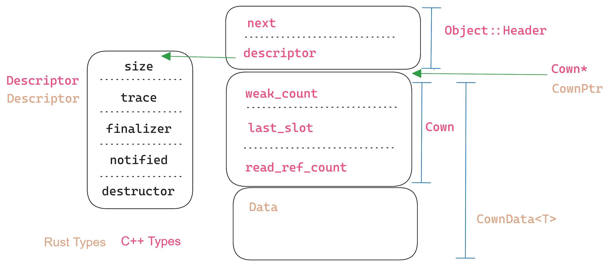

```{=latex}
\input{title.tex}
\begin{abstract}
```

The **Rust** programming language offers extensive support for concurrent and
parallel programming. While Rust is shown to be memory safe and datarace free,
it is not deadlock free.

**Behaviour-Oriented Concurrency** is a novel paradigm that extends the actor
model to allow atomically sending messages to multiple actors. Behaviour-Oriented
Concurrency is both datarace-free and deadlock-free. **`verona-rt`** is a C++
library that provides an efficient implementation of a runtime for
behaviour-oriented concurrency.

This project introduces the **`boxcars`** library, which implements
behaviour-oriented concurrency in Rust. It provides an idiomatic and type-safe
wrapper over the runtime from `verona-rt`.

We demonstrate that the `boxcars` API enforces the gaurenttes of
behaviour-oriented concurrency in ways that `verona-rt` is unable to. We also
demonstrate that using `boxcars` (instead of Rust's included `std::sync`
library) allows writing concurrent code that is deadlock-free by construction.
Furthermore, we demonstrate that it imposes minimal overhead over using
`verona-rt` directly.


```{=latex}
\end{abstract}
\renewcommand{\abstractname}{Acknowledgements}
\begin{abstract}
```

First and foremost, I must thank Marios Kogias for his excellent job as project
supervisor. His advice and guidance throughout the project has been stellar.

I'd also like to thank Matthew Parkinson, David Chisnall, and Sylvan Clebsch for
providing critical feedback when presented with a much earlier version of the
design, and pointing out a different direction to explore that ended up being
much more fruitful than my initial attempts.

I'd like to thank Nora for pointing out to me how to make
ThreadSanitizer work with Rust's standard library, and Mara Bos for chiming in
at the ideal time to point out a subtle interaction with thead-local
destructors.

Finally, I must give sincere thanks to Ed Page for developing and then
introducing me to the [typos](https://github.com/crate-ci/typos) tool, and to
Nathaniel B for spotting about one million grammatical mistakes and typos on an
earlier draft of this report. All remaining errors are mine.

```{=latex}
\end{abstract}
{
\hypersetup{linkcolor=}
\setcounter{tocdepth}{2}
\tableofcontents
}
```

# Introduction

Help!!!

```cpp {caption="Foo Code" label="code:foo"}
int main() {
    std::cout << "Lol";
}
```

```java {caption="Bar Code" label="code:bar"}
class Bar {}
```

Foo = \ref{code:foo}. Bar = \ref{code:bar}.


## Why


## How?

# Background

## Rust

Rust [@rust_book] is a systems programming language.

It has type safety, memory safety and freedom from data-races.

Rust's most important feature (for our purposes) is its system of **Ownership & Borrowing**.

### Ownership & Borrowing {#rust-ownership}

While a full tutorial on ownership and borrowing (and Rust more broadly) is well
beyond the scope of this report, it is important to understand the principles at
work, as they inform much of the later design. The core idea of **ownership** is
that each value has a unique owner, and that value is dropped [^dropped_def] when the owner
goes out of scope. To quote The Book [@rust_book]:

[^dropped_def]: "dropped" here refers to running the associated cleanup action
    for a given value, such as freeing an allocation, or closing a file. It's
    broadly equivalent to C++'s destructors.

> - Each value in Rust has an owner.
> - [For each value] there can only be one owner at a time.
> - When the owner goes out of scope, the value will be dropped.

Using just these rules, Rust could offer a type-safety and memory-safety.
However, it would be extremely cumbersome to program in. For example,
when a function took a parameter, that function becomes the owner of that
parameter, and the value can no longer be used.


```rust {.freefloat caption="A demonstration of ownership" label="own1"}
let x: String = make_string();  // `x` owns a `String`
do_thing_with_string(x);        // ownership of `x` transferred
do_other_thing_with_string(x);  // `x` cannot be used here
```

For example, in listing \ref{own1}, the variable `x` is the owner of a value of
type `String`. However, when calling `do_thing_with_string`, ownership is
moved (or _transferred_) to that function. This means that the value cannot be used in the
call to `do_other_thing_with_string`. Indeed, this is what the compiler error
in listing \ref{own1-err} shows us.

```text {.freefloat .breaklines caption="\captionerr{own1}" label="own1-err"}
error[E0382]: use of moved value: `x`
  --> src/main.rs:4:32
   |
2  | let x: String = make_string();
   |     - move occurs because `x` has type `String`, which does not implement the `Copy` trait
3  | do_thing_with_string(x);
   |                      - value moved here
4  | do_other_thing_with_string(x);
   |                            ^ value used here after move
   |
```

This is different to C++, where objects can be used after they are `std::move`d
from. However, the standard places no guarantees on the content of those
objects, only saying "moved-from objects shall be placed in a valid but
unspecified state" [@cppstd].

To avoid this constantly becoming a footgun for users, C++ values won't be moved
by default, but instead will be copied, which leaves the original value intact.
This is shown by \ref{cpp-copy}, where `x` is used both
 values are copied by default.

```cpp {.freefloat label="cpp-copy" caption="Demonstration of copies in C++"}
std::string x = make_string();
do_thing_with_string(x);       // `x` copied into `do_thing_with_string`
do_other_thing_with_string(x); // `x` still has it's contents here and can be used
```

If you want to move a value (and not pay the cost of creating a new value), C++
makes you do this explicitly, by calling the `std::move` function, as shown in
listing \ref{cpp-move}. However, unlike the Rust equivalent (listing \ref{own1})
this does compile, but `do_other_thing_with_string` may see any value, as it's
using `x` after it's been moved from [^uam_in_practice].

[^uam_in_practice]: In practice, this will be the empty string, but well written
    programs should not rely on this behaviour.

```cpp {.freefloat label="cpp-move" caption="Demonstration of moves in C++"}
std::string x = make_string();
do_thing_with_string(std::move(x)); // `x` copied into `do_thing_with_string`
do_other_thing_with_string(x);      // `x` "valid but unspecified" here.
```

In order to support this, C++ has a concept of copy and move constructors
[^assign_op], which allow users to run custom code whenever a value is moved (e.g.
to set the moved-from allocation to `NULL`) or copied (e.g. to create a new
allocation). In contrast, Rust moves are always bitwize (ie the result of
`memcpy`ing the value from the old to new location). However, as the old value
is guaranteed to never be accessed, libraries don't need to modify it on the way
out, to avoid use-after-free.

[^assign_op]: This means to fully support managing ownership of a value, a C++
    type should overload:

    1. Its destructor
    2. Its copy constructor
    3. Its copy assignment operator
    4. Its move constructor
    5. Its move assignment operator

    This is knows as the "Rule of 5" [@cpp_core_guidelines].

#### Borrowing

If values could only be owned and moved, than programming in Rust would be
extremely unergonomic. As shown, all values could only be used by a function
once, and then would no longer be accessible [^return_values].

[^return_values]: This could be  somewhat circumvented by having a function
return back it's arguments to the caller, but this would be extremely
cumbersome.

Therefore [^other_reasons], Rust has the additional notion of **borrowing**. A
value can be borrowed in one of two ways: by an immutable reference (spelt `&T`), or
an mutable reference (`&mut T`). 

[^other_reasons]: And for other reasons as well.

A value may have many shared references to it at a given time, but if it has any
exclusive reference to it that reference must be the only one. With a shared
reference, you can only read from the value. An exclusive reference is required
to mutate it. More succinctly, Rust references are "Aliasable XOR mutable"
[@boats_smaller,@JungThesis]. The fact that an immutable reference can be shared, while a
mutable reference must be exclusive has lead to these sometimes being call
shared references (for `&T`) and exclusive references (for `&mut T`)
[@dtolnay_ref].

Borrowed values have a **lifetime** for which they are borrowed. This is needed
to ensure that all exclusive references don't overlap with shared ones. This is
enforced by a part of the compiler called the "borrow checker", that assigns a
lifetime to each borrow, and uses this to determine if there are ever any
aliased mutable borrows. Listing \ref{lifetime_demo} contains an example of the
lifetimes assigned to various borrows.
 

```rust {.freefloat caption="Demonstration of lifetimes" label="lifetime_demo"}
let x: i32 = 0;

let shared_1: &i32 = &x; // Lifetime 1 starts
dbg!(shared_1);
// Lifetime 1 stops.

let exclusive_2: &mut i32 = &mut x; // Lifetime 2 starts

// It would be a compiler error to borrow `x` here (in either way), as it's already
// borrowed mutably/exclusivly by `exclusive_2`

*exclusive_2 += 10;
// Lifetime 2 ends

// But now that lifetime 2 is over, we can borrow `x` again

let shared_3: &i32 = &x; // Lifetime 3 starts
let shared_4: &i32 = &x; // Lifetime 4 starts

dbg!(shared_4);
// Lifetime 4 ends
dbg!(shared_3);
// Lifetime 3 ends
```

Because the borrow checker knows what values each borrow is borrowing from, it
is able to ensure that borrows are not dangling (instead of doing UB like it would in C++).
Listing \ref{rust-uaf} attempts to use a borrow to `short_lived` after it's gone
out of scope (and therefore dropped). This is caught by the compiler, as shown
be the error in listing \ref{rust-uaf-err}, whereas in C++ it would be undefined
behaviour.

```rust {.freefloat label="rust-uaf" caption="Attempting to use a reference to a value that's out of scope"}
let mut x: &i32 = 0;
{
    let short_lived: i32 = 0;
    x = &short_lived;
} // `short_lived` goes out of scope here.
dbg!(x);
```

```text {.freefloat label="rust-uaf-err" caption="\captionerr{rust-uaf}"}
error[E0597]: `short_lived` does not live long enough
 --> src/main.rs:5:13
  |
4 |         let short_lived: i32 = 0;
  |             ----------- binding `short_lived` declared here
5 |         x = &short_lived;
  |             ^^^^^^^^^^^^ borrowed value does not live long enough
6 |     }
  |     - `short_lived` dropped here while still borrowed
7 |     dbg!(x);
  |          - borrow later used here
```

<!-- TODO: ./todo/more-on-borrowing.md -->
<!-- TODO: Explain type-safe mutex's here. -->
<!-- TODO: Explain that rust in race-free here. -->
<!-- TODO: Idea of unsafe and builting safe abstractions from unsafe parts. -->

### Deadlocks

However, one area where Rust's type system doesn't do anything to help you is avoiding deadlocks.
One can trivially perform one by acquiring two mutexes in different orders, as shown in listings
\ref{rust-deadlock} and \ref{rust-deadlock-stdout}.


```Rust {.freefloat caption="Rust code that deadlocks by acquiring mutexes in different orders" label="rust-deadlock"}
fn main() {
    let m1 = Mutex::new(());
    let m2 = Mutex::new(());

    scope(|s| {
        s.spawn(|| {
            let g1 = m1.lock();
            sleep_ms(100); // not strictly necessary, but makes it more likely.
            println!("t1: got m1, trying to get m2");
            let g2 = m2.lock();
            println!("t1: got both");
        });

        s.spawn(|| {
            let g2 = m2.lock();
            sleep_ms(100);
            println!("t2: got m2, trying to get m1");
            let g1 = m1.lock();
            println!("t2: got both");
        });
    });
}
```

```text {.freefloat caption="Stdout from executing listing \ref{rust-deadlock}" label="rust-deadlock-stdout"}
t1: got m1, trying to get m2
t2: got m2, trying to get m1
```

While this example is obviously contrived, it demonstrates an important point, which that while Rust can statically prevent data-races
Rust deadlocks have come up in practice, and are usually much more subtle than
this [@snoyman_deadlock; @fasterthanlime_deadlock]. This is such a problem that
`parking_lot`, an library with alternative mutex implementation to the standard library,
offers an optional runtime deadlock-detector [@parking_lot]. 

<!-- TODO: How does rust prevent data-races. -->


## Behaviour-Oriented Concurrency

Behaviour-Oriented Concurrency (BoC) is a novel concurrency paradigm
[@when_concurrency_matters]. It has 2 key components:

- **Cowns**: A cown (short for concurrent owner) is a piece of data.

    A cown can be in one of two states: available or acquired. An available
    cown is eligible to be acquired by a behaviour, but its associated data
    cannot be accessed. An acquired cown can have its data accessed, but only
    while it's acquired.

    The only way to acquire a cown (and thus access its data) is to spawn a
    behaviour onto it, and cowns are only acquired for the duration of that
    behaviour, after which they become available again.

- **Behaviours**: A behaviour is a unit of execution that acts upon a set of cowns.

    When a behaviour is spawned, it is given the set of cowns it will acts on,
    as well as the code to run on them. When all the required cowns can be
    acquired, the code is executed, and then the cowns are made available again.

    A cown can only be acquired by one behaviour at any given. This can be
    thought of as being like each cown having a mutex, which is locked before the
    behaviour starts and unlocked after it ends. However, every cown in a
    behaviour is acquired atomically, and there is no change for deadlock.

    Note that this means that spawning a behaviour returns immediately, and the
    code inside will be executed at some indetermined future point, when unique
    access to all cowns can be guaranteed.


Listing \ref{boc-basics} contains a simple example of BoC code in some
hypothetical language.

```scala { .freefloat label="boc-basics" caption="Demonstration of BoC"}
var myCown: Cown[int] = cown.create(10);

when(myCown) {
    myCown += 10;    
}

myCown += 10; // invalid.
```

<!-- TODO: What's my point here. -->

BoC is both *data-race free* and *deadlock free*. No data races can occur, as
cowns can only be modified when acquired by behaviours. No deadlocks can occor,
as spawning a behaviour doesn't block but insteads schedules the behaviour to be executed
when all its cowns can be acquired.

<!-- TODO: This needs work. -->

## Verona Runtime

The Verona Runtime (also known as `verona-rt`) is a C++ library that
implements behaviour oriented concurrency. It is intended to be a part of the
currently in development Verona language, but it can also be used as a
freestanding C++ library today [@when_concurrency_matters].

It exposes both a the `verona::cpp` API, which uses templates to expose a typed
C++ api for cowns and behaviours, as well as the lower level `verona::rt` API,
which is used to implement `verona::cpp`, but can also be used in it's own
right. 

<!-- TODO: Discuss verona::rt
- Cown*
- Descriptors
- BehaviourCore
 -->

### `veronna::rt` API

#### `Cown`

#### `Descriptor`

### `verona::cpp` API

The `verona::cpp` API lets users write BoC programs in a nice DSL. For cowns,
it exposes the `cown_ptr<T>` type, which holds the underlying `T` behind a
reference-count, but doesn't allow access to it directly. This enforces the
invariant in BoC that cowns can only be accessed when they're acquired.

To acquire a cown, you can use the `when` function. This takes in the cowns you
want to acquire, and a lambda to invoke on those cowns. This lambda is passed a
parameter of type `acquired_cown<T>`. This represents the same cown that was
passed in the argument, but with the idea that it's acquired (and therefore
allowed to mutate the cown's underlying data) encoded in the type system.
Listing \ref{rt-cpp-1} shows an example of this [^cppinfer].

[^cppinfer]: I'm choosing to give the type declaration of all variables for
    clarity. On actual code, most of these can be inferred, and will be written
    as `auto` instead.

```cpp {.freefloat label="rt-cpp-1" caption="Creating and acquiring a cown with the \texttt{verona::cpp} library"}
cown_ptr<int> my_cown = make_cown<int>(10);
when(my_cown) << [](acquired_cown<int> my_cown) {
    // cown acquired in here.
};
```

Unlike `cown_ptr<T>`, `acquired_cown<T>` does allow access to and mutation of
the underling data. By overloading `operator->`, `operator*` and `operator T&`, it is able
to provide transparent access to the underlying data, as shown in listing \ref{rt-cpp-2}.

```cpp {.freefloat label="rt-cpp-2" caption="Mutating and accessing a cown that has been acquired"}
auto f = make_cown<std::string>("hello");

when(f) << [](auto f) {
  f->push_back('!');
  std::cout << *f << '\n';
};
```

But when a cown isn't acquired, as in listing \ref{cpp-bad-access}, it's a
compiler error to attempt to access the contained data (listing \ref{cpp-bad-access-err}).

```cpp {.freefloat label="cpp-bad-access" caption="Attempting to access a non-acquired cown"}
auto f = make_cown<std::string>("hello");

when(f) << [](auto f) {
  f->push_back('!'); // This is ok, cown acquired
};

f->push_back('?'); // Compiler error, cown not acquired
```

```text {.freefloat .breaklines label="cpp-bad-access-err" caption="\captionerr{cpp-bad-access}"}
playground.cc: In function ‘void real_main()’:
playground.cc:35:4: error: base operand of ‘->’ has non-pointer type ‘verona::cpp::cown_ptr<std::__cxx11::basic_string<char> >’
   35 |   f->push_back('?');
      |    ^~
```

#### How `cown_ptr` and `acquired_cown` model BoC {#verona_cpp_ptr}

In order to have `cown_ptr` and `acquired_cown` correctly model the semantics of
a cown in BoC, they must do a few things.

1. A `cown_ptr` must always point to a non-dangling cown.
2. An `acquired_cown` must only be accessible when that cown has been acquired.

The first of these is achieved by having `cown_ptr` overload its
constructors, assignment operators, and destructor to maintain the cowns internal
reference-count. Much like `std::shared_ptr`, this means that when the user does
`cown_ptr<int> b = a`, the reference count of the cown is incremented.

To achieve the second, `acquired_cown` is made to only be constructable by
certain classes inside the `verona::cpp` namespace. These will only do so in
order to pass to the lambda given to `when`, and in no other circumstance.
Therefore, the only way to obtain an `acquired_cown` is when it has been acquired
by a behaviour created with `when`.

In addition `acquired_cown` detete's its move and copy constructors, and its
assignment operators, so that users cannot store it anywhere other than the
parameter of the lambda. This means that attempts to store an `acquired_cown` such that it can be accessed later (e.g. listing \ref{cpp-squirrel})
are turned into compiler error (e.g. listing \ref{cpp-squirrel-error}).

```cpp {.freefloat label="cpp-squirrel" caption="Attempting to store a \texttt{acquired\\_cown} for use later"}
cown_ptr<int> cown = make_cown<int>(10);
when(cown) << [](acquired_cown<int> f) { squirrel_away_for_later(f); };
```

```text {.freefloat .breaklines label="cpp-squirrel-error" caption="\captionerr{cpp-squirrel}"}
playground.cc: In lambda function:
playground.cc:35:67: error: use of deleted function ‘verona::cpp::acquired_cown<T>::acquired_cown(const verona::cpp::acquired_cown<T>&) [with T = int]’
   35 |   when(cown) << [](acquired_cown<int> f) { squirrel_away_for_later(f); };
      |                                            ~~~~~~~~~~~~~~~~~~~~~~~^~~
In file included from verona-rt/src/rt/./cpp/when.h:6,
                 from playground.cc:1:
verona-rt/src/rt/./cpp/cown.h:464:5: note: declared here
  464 |     acquired_cown(const acquired_cown&) = delete;
      |     ^~~~~~~~~~~~~
playground.cc:27:49: note:   initializing argument 1 of ‘void squirrel_away_for_later(verona::cpp::acquired_cown<int>)’
   27 | void squirrel_away_for_later(acquired_cown<int> acq);
      |                              ~~~~~~~~~~~~~~~~~~~^~~
```

#### Circumventing access guarantees via pointer.

While the behaviour discussed above (§\ref{verona_cpp_ptr}) ensures than an
`acquired_cown` can only be accessed when that cown is acquired, this doesn't
ensure that the *cowns data* can only be accedded when that cown is acquired. As
shown in listing \ref{cpp-bypass-safety}, a user can get a pointer to the
underlying data from an `acquired_cown`, and nothing prevents that pointer being
used to access the cown even after it's no longer acquired by the behaviour in
which it was obtained.

```cpp {.freefloat label="cpp-bypass-safety" caption="Accessing a cowns data when that cown isn't acquired"}
cown_ptr<int> my_cown = make_cown<int>(10);
int* escape_data;
when(my_cown) << [&escape_data](acquired_cown<int> my_cown) {
    escape_data = &*my_cown;
};
sleep(3); // Wait for behaviour to run
*escape_data += 10; // Modifies cown without acquiring!!!
```

Because users can access a cowns data when it it no longer acquired, the
`verona::cpp` implementation of BoC fails to provide datarace freedom, even
though the underlying BoC model it does. This is because C++ isn't expressive
enough to encode the idea the an acquired cown (the BoC concept, not the C++
implementation of said concept) can only be accessed for a limited duration.
This is because C++ has no mechanism to limit how long a pointer/reference can
be used, and the `acquired_cown` class must give out pointers/references to
allow access to the underlying data.

Rust can solve this with the power of lifetimes.
<!-- TODO: Is this line a good idea? -->

<!--
### Other concurrency paradise

- Shared Memory
- Message Passing
- Fork/Join
- Actors
- Structured Concurrency
-->

# Design and Implementation of a Rust Library for Behaviour-Oriented Concurrency

The `boxcars` library implements BoC cowns and behaviours on top of the
`verona-rt` runtime.

A significant challenge is that Rust code can't call C++ functions directly,
only C ones.
<!-- TODO: Something about monomorphization that these OS people will understand. -->

## Cowns {#design-cowns}

The first thing we need to do is have a `Cown` type that represents some data. 
The cown will be a pointer to a heap allocation that contains:

1. Scheduling state
2. Reference count
3. The data.

1 and 2 should be managed by the `verona-rt` library, but it's unable to know
about the user data. That's because the data is a generic parameter, and this
won't work over FFI.

The rust `Cown<T>` type is a wrapper over a `verona::rt::Cown*`. Note that the
rust-side type caries type information, but the C++ side doesn't. That's because
`T` can be any Rust type. The full declaration is given in listing \ref{boxcars-cownptr-decl} [^phantom].

[^phantom]: The actual declaration of `Cown` also has a
    [`PhantomData`](https://doc.rust-lang.org/1.79.0/std/marker/struct.PhantomData.html)
    field, which is needed as Rust disallows unused type parameters. However it's elided here, for not being relevant.

```rust {.freefloat label="boxcars-cownptr-decl" caption="Declaration of \texttt{boxcars::Cown} type"}
pub struct Cown<T> {
   cown_ptr: CownPtr,
}

/// a `verona::rt::Cown*`
#[repr(transparent)]
struct CownPtr {
   addr: *mut (),
}
```

`CownPtr` is kept as its own type, as it's useful for both `boxcars::Cown` and
`boxcars::AcquiredCown`. It must be marked as `#[repr(transparent)]` to ensure
it is treated like a pointer at an ABI level [@rust_reference].

### Maintaining the Reference Count

As `Cown<T>` is a reference-counted pointer to some on-heap `T`, we need to
ensure the reference-count is maintained. Unlike `verona::cpp::cown_ptr`
(§\ref{verona_cpp_ptr}), we cannot override constructors or assignment
operators, as Rust only supports bitwise moves (§\ref{rust-ownership}). This is
different to C++, due to Rust's different ownership model. Rust will never
implicitly call user code when assigning an object, but as the moved-from value
isn't dropped, no reference-count updates are needed in these cases.

However, we still want a way to duplicate a `Cown` and increment the reference
count. For this sort of action [^when_clone], Rust uses the
[`Clone`](https://doc.rust-lang.org/1.79.0/std/clone/trait.Clone.html) trait,
which is used in broadly the same situations as a copy constructor in C++
[^cpp_rust_clone_copy], but requires being called explicitly. Similarly, we can
implement the [`Drop`](https://doc.rust-lang.org/1.79.0/std/ops/trait.Drop.html)
trait to decrement the reference count when the value goes out of scope. These
implementations, shown in listing \ref{cown-clone-impl} and
\ref{cown-drop-impl}, simply call into foreign function interface (FFI) code
that can manipulate the reference count.

[^when_clone]: Duplicating a value.

[^cpp_rust_clone_copy]: Confusingly, what C++ calls "copyable"
    ([`std::copyable`](https://en.cppreference.com/w/cpp/concepts/copyable)) is
    equivalent to Rust's idea of "cloneable"
    ([`std::clone::Clone`](https://doc.rust-lang.org/1.79.0/std/clone/trait.Clone.html)), both of which
    broadly mean an object can be duplicated by potentially running code. Meanwhile what Rust calls
    "copyable" ([`std::marker::Copy`](https://doc.rust-lang.org/1.79.0/std/marker/trait.Copy.html)) instead corresponds to
    C++'s idea of "trivially copyable" ([`std::is_trivially_copyable`](https://en.cppreference.com/w/cpp/types/is_trivially_copyable)),
    both of which correspond to types that can be duplicated purely by duplicating the underling bytes.

    This has caused endless confusion, as the difference between these two
    concepts is super important, and the two languages with the most support for
    this kind of thing choosing to use "copy" to mean the two different things is
    extremely unfortunate.
  
    Speaking personally, I learn the Rust terminology far before the C++ one, and
    think in terms of it.


```rust {.freefloat label="cown-clone-impl" caption="\texttt{Clone} implementation for \texttt{boxcars::Cown}"}
impl<T> std::clone::Clone for Cown<T> {
    fn clone(&self) -> Self {
        unsafe {
            ffi::boxcars_acquire_object(self.cown_ptr);
        }

        Self {
            cown_ptr: self.cown_ptr,
            _marker: PhantomData,
        }
    }
}
```

```rust {.freefloat label="cown-drop-impl" caption="\texttt{Drop} implementation for \texttt{boxcars::Cown}"}
impl<T> std::ops::Drop for Cown<T> {
    fn drop(&mut self) {
        unsafe { ffi::boxcars_release_object(self.cown_ptr) };
    }
}
```

Then on the C++ side, we have very simple helper functions, that forward to
`verona-rt`'s reference-counting implementation (listing \ref{cpp-refcount}). We
can't call the `verona::rt::Cown::acquire` static method directly from Rust, as
it's not declared as `extern "C"`, so it will have a mangled name that Rust code
won't be able to link to [^mangle]. Importantly, despite the `Clone` and `Drop`
implementation being generic over `T`, the `boxcars_acquire_object` and
`boxcars_release_object` functions arn't generic/templated. This
is because `boxcars` maintains a strict separation, where the C++ side never
knows about the Rust data being stored in cowns, and the Rust side doesn't know
how the C++ represents the scheduling/reference-counting state of cowns.

[^mangle]: By default, both Rust and C++ mangle their symbol names when producing object files. To make FFI
    calls between them, both languages must use `extern "C"` to tell the compiler not to use name mangling,
    and to use the C ABI/calling convention.


```c++ {.freefloat label="cpp-refcount" caption="C++ side of reference counting"}
using verona::rt::Cown;


extern "C"
{
  void boxcars_acquire_object(Cown* o)
  {
    Cown::acquire(o);
  }
  void boxcars_release_object(Cown* o)
  {
    auto& alloc = verona::rt::ThreadAlloc::get();
    Cown::release(alloc, o);
  }
}
```

### Construction and Destruction

The remaining operations are creating a new `Cown`, and running the destructor
on the underlying data once the reference-count reaches zero. It turns out these
are closely related.

<!-- TODO: Link to background::verona_rt::rt::descriptor if that get's written. -->

The core problem when creating a `Cown` was that the `verona::rt::Cown` could
only be created from C++, but C++ couldn't know about the `T` in a
`boxcars::Cown<T>`. However, we need to know what `T` in order to create an
appropriately sized heap allocation. But this is the only property that's
required, and we can communicate this via a simple parameter of type `size_t`
(instead of needing to template). The C++ size will do a heap allocation of the
requested size, and initialise a `verona::rt::Cown` at the top of it. It can
then pass a pointer to this allocation back to Rust, which moves its `T` to the
bottom.
<!-- I'm probably being dumb, but why couldn't C++ know about the T?
Explain this, and monomorphization in general.
 -->

This is implemented in listing \ref{rs-cown-new}. It creates a descriptor of the cown it would like
(which includes the size), and then passes that over to C++. The C++ only initialises the `verona::rt::Cown`,
Then the Rust moves `value` into that heap allocation using [`std::ptr::write`](https://doc.rust-lang.org/1.79.0/std/ptr/fn.write.html).

```rust {.freefloat label="rs-cown-new" caption="Implementation of \texttt{boxcars::Cown::new}"}
impl<T> Cown<T> {
    pub fn new(value: T) -> Self {
        unsafe {
            let desc = get_descriptor::<CownData<T>>();
            let cown_ptr = ffi::boxcars_allocate_cown(desc);
            let this = Self { cown_ptr };
            std::ptr::write(this.data_ptr(), value);
            this
        }
    }
}
```

<!-- TODO: Explain CownData<T>? -->

Figure \ref{boxcars-cown-diagram} shows what this looks like in memory. The
single heap allocation for a cown contains both the `verona::rt::Cown`, which
stores scheduling and reference counting information, as well as the user's data.
It also has a pointer to a (per-type) descriptor. This descriptor stores a
pointer to the destructor function, which is called when the reference count
reaches 0.

```{=latex}
\begin{figure}[h]
```

```{=latex}
\caption{In-memory layout of a cown in \texttt{boxcars}}
\label{boxcars-cown-diagram}
\end{figure}
```

The rust `get_descriptor` function returns a pointer to a statically-allocated
descriptor. It contains the size needed for the underlying heap allocation, as
well as a pointer to the type-eraised destructor that will run the destructor
for the Rust-managed data after the reference-count reaches 0, but before the
cown's allocation is freed.

## Behaviours {#design-behaviours}

## Behaviour API

## Scheduler


# Performance Evaluation.

One important metric to evaluate the project on is performance. As discussed previously (§\ref{design-cowns}), it's not simple to call into the C++ runtime from Rust, and I had to be somewhat indirect due to the FFI boundary. I wanted to measure the performance overhead of this, versus C++ code that can call it directly. 

Note: In all benchmarks below, `Rust` indicates using my `boxcars` library, whereas `C++` indicates using the `verona-rt` library directly.

All graphs were created using the excellent [`criterion`](https://github.com/bheisler/criterion.rs) (TODO: Cite?) library.

## Microbenchmarks

The first way to try to understand this would be with small microbenchmarks that
do just one thing. This would let us get a direct comparison for exactly
equivalent actions.

### Creating Cowns


**Figure 1: Time to create $n$ cowns**

The first benchmark I wrote was to create a vector of $n$ `Cown`s, and then free them. This was to measure the overhead of Rust not being able to interact directly with the `Cown` constructors, but having to do it via FFI, as discussed previously (§\ref{design-cowns}).


```rust
// Rust
let mut v = Vec::with_capacity(n);
for i in 0..n {
    v.push(Cown::<usize>::new(i));
}
```

```c++
// C++
std::vector<cown_ptr<size_t>> v;
v.reserve(n);

for (size_t i = 0; i < n; i++)
{
    v.push_back(make_cown<size_t>(i));
}
```

This overhead is measurable, but relatively small, with it only being 0.03ms when creating $2^{15}$ `Cown`s.

### Scheduling behaviours


**Figure 2: Time to schedule and run $n$ behaviours** 

The other major implementation difference is how behaviours are scheduled onto
the `Cown`s, with Rust also needing indirection over FFI (§\ref{design-behaviours}). Therefore
I benchmarked scheduling a large number of behaviours that do minimal work, to
measure the cost of the scheduling and execution itself.

As shown, the FFI indirection imposes very little additional overhead over the C++ code which can interact directly with the runtime.

```rust
// Rust
let c = Cown::new(0);
for _ in 0..n {
    when(&c, |mut c| {
        *c += 1;
    })
}
```

```c++
// C++
auto c = make_cown<int>(0);
for (int j = 0; j < n; j++)
{
    when(c) << [](auto c) { c++; };
}
```


### Setting up scheduler

```{=latex}
\mbox{}\\
```


**Figure 3: Time to create and run a scheduler doing nothing**

The final thing to consider is how long it takes to set up the global scheduling
state. Both libraries consistently take around 300μs to do so. In other
microbenchmarks, it was important to do this outside the loop being benchmarked,
to ensure that I was timing the code being benchmarked, and not having the
overhead of setting up and then tearing down the executors thread and memory
pool.

```rust
// Rust
with_n_threads(1, || { /* no-op */ })
```

```cpp
// C++
Scheduler::get().init(1);
Scheduler::get().run();
```


### Busy looping


```{=latex}
\mbox{}\\
```


**Figure 4: Time to busy loop for $n$ µsecs**


To do this, I wrote a benchmark that would busy loop for a given length of time.
This would allow me to know how long a given benchmark "should" take, and
therefore see if this was replicated in the data.

As the graph shows, it takes almost exactly $n$μs to run a behaviour that busy
loops for $n$ μs (as expected!). As all these times are much shorter than the
~300μs time to create the scheduler, this let me verify that my benchmarking was
only measuring the "work" getting done, and not anything else. 

```rust
// Rust
let c = Cown::new(usecs);
when(&c, |c| unsafe {
    boxcars_busy_loop(*c);
})
```

```cpp
// C++
auto c = make_cown<size_t>(nsecs);    
when(c) << [](auto c) { busy_loop(*c); };    
```

## Larger Benchmarks

Performance is kind of mixed.


# Evaluation of User Experience

Of course, performance isn't the only thing worth measuring. It's also worth
considering what it's like to *use* these libraries, and how the language and
API differences impact what it's like to write BoC code in them.

## Splitting Borrows of Fields Behind a Cown

While most of the time `AcquiredCown<'a, T>` acts like a transparent wrapper
over `&'a mut T`, there are some cases where this abstraction becomes leaky, and
users need to be aware that they're not dealing with a normal reference.

```rust {.freefloat label="autoderef-example" caption="Demonstration of auto-deref"}
    let cown = Cown::<i32>::new(10);

    // This type annotation isn't needed, but makes the coercion clearer
    //                     vvvvvvvvvvvvvvvvv
    when(&cown, |acq_cown: AcquiredCown<i32>| {
        let n: i32 = *acq_cown; 
    });
```

In code like that in listing \ref{autoderef-example}, `acq_cown` acts like an
`&mut i32`, and is able to be dereferenced into `i32`. This even extends to
method calls, as shown in listing \ref{autoderef-methods}, where we can call
[`to_uppercase`](https://doc.rust-lang.org/1.79.0/std/primitive.str.html#method.to_uppercase)
(a method defined on `&str`) on an `AcquiredCown<&str>`.

```rust {.freefloat label="autoderef-methods" caption="Calling methods on acquired cowns via auto-deref"}
    let cown = Cown::<&str>::new("hello");

    when(&cown, |acq_cown: AcquiredCown<&str>| {
        let uppercase_str = acq_cown.to_uppercase();
    });
```

This is possible because `AcquiredCown` implements the
[`Deref`](https://doc.rust-lang.org/1.79.0/std/ops/trait.Deref.html) and
[`DerefMut`](https://doc.rust-lang.org/1.79.0/std/ops/trait.DerefMut.html)
traits. The Rust compiler will implicitly insert calls to these traits' methods to
allow an `AcquiredCown<T>` to be treated like an `&mut T`. This normally works
seamlessly, as shown in listings \ref{autoderef-example} and
\ref{autoderef-methods}.

```rust {.freefloat label="partial-works" caption="Demonstration of partial borrowing"}
struct Foo {
    a: i32,
    b: i32,
}

fn use_ints(x: &mut i32, y: &mut i32) {
    *x += 1;
    *y += 1;
}

let mut foo = Foo { a: 1, b: 1 };
use_ints(&mut foo.a, &mut foo.b);
```

However, this abstraction doesn't always hold. The code in listing
\ref{partial-works} compiles and executes successfully. Unfortunately a naïve
translation of this code to BoC (listing \ref{needs-partial}) fails to compile, giving the error shown in 
\ref{multiborrow-error}.


```rust {.freefloat label="needs-partial" caption="Attempting to borrow two fields of a struct in a cown"}
let cown = Cown::new(Foo { a: 1, b: 1 });
when(&cown, |mut acq_cown: AcquiredCown<Foo>| {
  use_ints(&mut acq_cown.a, &mut acq_cown.b)
});
```

```{caption="\captionerr{needs-partial}" label="multiborrow-error"}
error[E0499]: cannot borrow `acq_cown` as mutable more than once at a time
 --> crates/verona-rt/examples/play.rs:6:40
  |
6 |   use_ints(&mut acq_cown.a, &mut acq_cown.b)
  |   --------      --------         ^^^^^^^^ second mutable borrow occurs here
  |   |             |
  |   |             first mutable borrow occurs here
  |   first borrow later used by call

For more information about this error, try `rustc --explain E0499`.
```

This occurs because the compiler inserts calls to the the `deref_mut` method,
to convert from `&mut AcquiredCown<Foo>` (which doesn't have fields `a` or `b`)
to `&mut Foo` (which does). This happens both times `acq_cown` is dereferenced,
with the compiler desugaring it into the code given in listing \ref{autoderef-desugared}.

```rust {.freefloat label="autoderef-desugared" caption="The desugaring of the call to \texttt{use\\_ints} in listing \ref{needs-partial}"}
use_ints(
    &mut <AcquiredCown<Foo> as DerefMut>::deref_mut(&mut acq_cown).a,
    &mut <AcquiredCown<Foo> as DerefMut>::deref_mut(&mut acq_cown).b,
)
```

This code has a compiler error (listing \ref{autoderef-desugared-err}), as it
attempts to borrow `acq_cown` mutably twice. Why then does listing
\ref{partial-works} compile, when it seemingly does the same thing? The answer
is that the borrow checker is able to understand that we are borrowing disjoint fields of a struct, and therefor
the borrows are not overlapping [@nomicon].
<!-- TODO: Mention that this is called split borrows. -->

However, when borrowing from an `AcquiredCown<T>` (instead of a `&mut T`), we
must first borrow the _entire_ cown to pass to the `deref_mut` method. Only then
can we borrow the individual field that we want. At the time of the
`deref_mut` call, we have borrowed _all_ of `acq_cown`. Whereas in listing
\ref{partial-works}, we never borrow all of `foo`, only its individual fields.

```text {.freefloat caption="\captionerr{autoderef-desugared}" label="autoderef-desugared-err"}
error[E0499]: cannot borrow `acq_cown` as mutable more than once at a time
  --> tests/ui/partial-borrow.rs:30:65
   |
28 |  use_ints(
   |  -------- first borrow later used by call
29 |      &mut <AcquiredCown<Foo> as DerefMut>::deref_mut(&mut acq_cown).a,
   |                                                      ------------- first mutable borrow occurs here
30 |      &mut <AcquiredCown<Foo> as DerefMut>::deref_mut(&mut acq_cown).b,
   |                                                      ^^^^^^^^^^^^^ second mutable borrow occurs here
```

It is possible to work around this. As shown in
\ref{partial-borrows-workaround}, one can instead first borrow the _entire_
cown, and then borrow the fields on that.

```rust {.freefloat label="partial-borrows-workaround" caption="Version of \ref{needs-partial} that compiles"}
when(&cown, |mut acq_cown: AcquiredCown<Foo>| {
    let mut_ref: &mut Foo = &mut *acq_cown;
    use_ints(&mut mut_ref.a, &mut mut_ref.b)
});
```

Here, deref coercion only happens once, on the second line, to declare `mut_ref`. Then on the
third line, we can split the borrow on `mut_ref` to get the two fields
we want. This is allowed, because there's no hidden function calls here, so the
borrow checker can locally check that we're obeying Aliasing XOR Mutation.

An alternative design that was considered was to have the closure in `when` be
given `&mut T` (as oppsed to `AcquiredCown<T>`). This would alleviate the
borrowing issues discussed above. However, it would mean that code such as
listing \ref{why-acquiredcown} would cease to work, as we'd no longer store
the information that the argument was a cown anywhere in the system, so it wouldn't
be possible to schedule another behaviour onto it.


```rust {.freefloat label="why-acquiredcown" caption="Scheduling a new behaviour onto a cown acquired by another behaviour"}
when((a, b), |(a, b)| {
  do_something_with(a, b);
  when(&a.cown(), |a| do_something_else_with(a));
  when(&b.cown(), |b| do_a_third_thing_with(b));
});
```


## Compiler Errors

Because Rust checks generics at the call site, rather than using template
expansion, is can often produce much nicer error messages than the equivalent
from C++.

(Note: comparing `g++ 13.2.0` to `rustc 1.78.0`)

### Wrong Cown constructor.

The most frequently encountered one of these when writing the benchmarks was getting 

```c++
class Foo
{
  int number_;
  const char* str_;

public:
  Foo(int number, const char* str) : number_(number), str_(str) {}
};

// These are the wrong way round
auto c_foo = make_cown<Foo>("hello", 101);
```


```
In file included from verona-rt/src/rt/./cpp/when.h:6,
                 from cpp/playground.cc:1:
verona-rt/src/rt/./cpp/cown.h: In instantiation of ‘verona::cpp::ActualCown<T>::ActualCown(Args&& ...) [with Args = {const char (&)[6], int}; T = Foo]’:
verona-rt/src/rt/./cpp/cown.h:374:24:   required from ‘verona::cpp::cown_ptr<T> verona::cpp::make_cown(Args&& ...) [with T = Foo; Args = {const char (&)[6], int}]’
cpp/playground.cc:27:30:   required from here
verona-rt/src/rt/./cpp/cown.h:50:32: error: invalid conversion from ‘const char*’ to ‘int’ [-fpermissive]
   50 |     ActualCown(Args&&... ts) : value(std::forward<Args>(ts)...)
      |                                ^~~~~~~~~~~~~~~~~~~~~~~~~~~~~~~~
      |                                |
      |                                const char*
cpp/playground.cc:21:11: note:   initializing argument 1 of ‘Foo::Foo(int, const char*)’
   21 |   Foo(int number, const char* str) : number_(number), str_(str) {}
      |       ~~~~^~~~~~
verona-rt/src/rt/./cpp/cown.h:50:32: error: invalid conversion from ‘int’ to ‘const char*’ [-fpermissive]
   50 |     ActualCown(Args&&... ts) : value(std::forward<Args>(ts)...)
      |                                ^~~~~~~~~~~~~~~~~~~~~~~~~~~~~~~~
      |                                |
      |                                int
cpp/playground.cc:21:31: note:   initializing argument 2 of ‘Foo::Foo(int, const char*)’
   21 |   Foo(int number, const char* str) : number_(number), str_(str) {}
      | 
```

Whereas in Rust if you make the same mistake:

```rust
struct Foo {
    number: i32,
    string: &'static str,
}

impl Foo {
    fn new(number: i32, string: &'static str) -> Self {
        Self { number, string }
    }
}

let c_foo = Cown::new(Foo::new("hello", 101));
```

You instead get:

```
error[E0308]: arguments to this function are incorrect
  --> crates/verona-rt/examples/err.rs:15:27
   |
15 |     let c_foo = Cown::new(Foo::new("hello", 101));
   |                           ^^^^^^^^ -------  --- expected `&'static str`, found `{integer}`
   |                                    |
   |                                    expected `i32`, found `&'static str`
   |
note: associated function defined here
  --> crates/verona-rt/examples/err.rs:10:12
   |
10 |         fn new(number: i32, string: &'static str) -> Self {
   |            ^^^ -----------  --------------------
help: swap these arguments
   |
15 |     let c_foo = Cown::new(Foo::new(101, "hello"));
   |                                   ~~~~~~~~~~~~~~

For more information about this error, try `rustc --explain E0308`.
```

Which is much more understandable, as it doesn't need to take a detour through the templated library code.
<!-- TODO: More here about not needing std::forward -->

### Wrong Args

Another case to consider is getting the arguments to the behaviour wrong.

```c++
auto a = make_cown<uint32_t>(101);
when(a) << [](acquired_cown<bool> a) {};
```

This causes C++ compilers to spew out the internals of the `when` implementation, because the type signature isn't part of then `when` function:

```
In file included from cpp/playground.cc:1:
verona-rt/src/rt/./cpp/when.h: In instantiation of ‘auto verona::cpp::When<F, Args>::to_tuple() [with F = real_main()::<lambda(verona::cpp::acquired_cown<bool>)>; Args = {verona::cpp::Access<unsigned int>}]’:
verona-rt/src/rt/./cpp/when.h:181:28:   required from ‘void verona::cpp::Batch<Args>::create_behaviour(verona::rt::BehaviourCore**) [with long unsigned int index = 0; Args = {verona::cpp::When<real_main()::<lambda(verona::cpp::acquired_cown<bool>)>, verona::cpp::Access<unsigned int> >}]’
verona-rt/src/rt/./cpp/when.h:204:25:   required from ‘verona::cpp::Batch<Args>::~Batch() [with Args = {verona::cpp::When<real_main()::<lambda(verona::cpp::acquired_cown<bool>)>, verona::cpp::Access<unsigned int> >}]’
verona-rt/src/rt/./cpp/when.h:486:16:   required from ‘auto verona::cpp::PreWhen<Args>::operator<<(F&&) [with F = real_main()::<lambda(verona::cpp::acquired_cown<bool>)>; Args = {verona::cpp::Access<unsigned int>}]’
cpp/playground.cc:19:41:   required from here
verona-rt/src/rt/./cpp/when.h:398:27: error: no match for call to ‘(std::remove_reference<real_main()::<lambda(verona::cpp::acquired_cown<bool>)>&>::type {aka real_main()::<lambda(verona::cpp::acquired_cown<bool>)>}) (verona::cpp::acquired_cown<unsigned int>)’
  398 |               std::move(f)(access_to_acquired<typename Args::Type>(args)...);
      |               ~~~~~~~~~~~~^~~~~~~~~~~~~~~~~~~~~~~~~~~~~~~~~~~~~~~~~~~~~~~~~~
verona-rt/src/rt/./cpp/when.h:398:27: note: candidate: ‘void (*)(verona::cpp::acquired_cown<bool>)’ (conversion)
verona-rt/src/rt/./cpp/when.h:398:27: note:   candidate expects 2 arguments, 2 provided
cpp/playground.cc:19:14: note: candidate: ‘real_main()::<lambda(verona::cpp::acquired_cown<bool>)>’
   19 |   when(a) << [](acquired_cown<bool> a) {};
      |              ^
cpp/playground.cc:19:14: note:   no known conversion for argument 1 from ‘acquired_cown<unsigned int>’ to ‘acquired_cown<bool>’
```

Rust

```rust
let a = Cown::<u32>::new(101);
when(&a, |a: AcquiredCown<bool>| {});
```

which gives:

```
error[E0631]: type mismatch in closure arguments
  --> crates/verona-rt/examples/err.rs:20:5
   |
20 |     when(&a, |a: AcquiredCown<bool>| {});
   |     ^^^^^^^^^-----------------------^^^^
   |     |        |
   |     |        found signature defined here
   |     expected due to this
   |
   = note: expected closure signature `for<'a> fn(AcquiredCown<'a, u32>) -> _`
              found closure signature `fn(AcquiredCown<'_, bool>) -> _`
note: required by a bound in `when`
  --> /home/alona/dev2/boxcars/crates/verona-rt/src/variadic_when.rs:14:8
   |
11 | pub fn when<C, F>(cowns: C, func: F)
   |        ---- required by a bound in this function
...
14 |     F: for<'a> FnOnce(C::Acquired<'a>) + Send + 'static,
   |        ^^^^^^^^^^^^^^^^^^^^^^^^^^^^^^^ required by this bound in `when`

For more information about this error, try `rustc --explain E0631`.
```

### Rustc being helpful and unhelpfull

```rust
let foo = Cown::new(101);
let bar = Cown::new(202);

when((&foo, &bar), |foo, bar| {});
```

gives:

```
error[E0593]: closure is expected to take a single 2-tuple as argument, but it takes 2 distinct arguments
  --> crates/verona-rt/examples/err.rs:22:5
   |
22 |     when((&foo, &bar), |foo, bar| {});
   |     ^^^^^^^^^^^^^^^^^^^----------^^^^
   |     |                  |
   |     |                  takes 2 distinct arguments
   |     expected closure that takes a single 2-tuple as argument
   |
help: change the closure to accept a tuple instead of individual arguments
   |
22 |     when((&foo, &bar), |(foo, bar)| {});
   |  
```

However, not all cases can be caught, and you definitely can still get unhelpfull error messages:

```rust
let foo = Cown::new(101);
let bar = Cown::new(202);

when((foo, bar), |(foo, bar)| {});
```

Which produces:

```
error[E0277]: the trait bound `(Cown<{integer}>, Cown<{integer}>): CownCollection` is not satisfied
  --> crates/verona-rt/examples/err.rs:22:10
   |
22 |     when((foo, bar), |(foo, bar)| {});
   |     ---- ^^^^^^^^^^ the trait `CownCollection` is not implemented for `(Cown<{integer}>, Cown<{integer}>)`
   |     |
   |     required by a bound introduced by this call
   |
   = help: the following other types implement trait `CownCollection`:
             (&Cown<A>, &Cown<B>)
             (&Cown<A>, &Cown<B>, &Cown<C>)
             (&Cown<A>, &Cown<B>, &Cown<C>, &Cown<D>)
             (&Cown<A>, &Cown<B>, &Cown<C>, &Cown<D>, &Cown<E>)
             (&Cown<A>, &Cown<B>, &Cown<C>, &Cown<D>, &Cown<E>, &Cown<F>)
             (&Cown<A>, &Cown<B>, &Cown<C>, &Cown<D>, &Cown<E>, &Cown<F>, &Cown<G>)
             (&Cown<A>, &Cown<B>, &Cown<C>, &Cown<D>, &Cown<E>, &Cown<F>, &Cown<G>, &Cown<H>)
             (&Cown<A>, &Cown<B>, &Cown<C>, &Cown<D>, &Cown<E>, &Cown<F>, &Cown<G>, &Cown<H>, &Cown<I>)
note: required by a bound in `when`
  --> /home/alona/dev2/boxcars/crates/verona-rt/src/variadic_when.rs:13:8
   |
11 | pub fn when<C, F>(cowns: C, func: F)
   |        ---- required by a bound in this function
12 | where
13 |     C: CownCollection,
   |        ^^^^^^^^^^^^^^ required by this bound in `when`

error[E0277]: expected a `FnOnce(<(Cown<{integer}>, Cown<{integer}>) as CownCollection>::Acquired<'a>)` closure, found `_`
  --> crates/verona-rt/examples/err.rs:22:22
   |
22 |     when((foo, bar), |(foo, bar)| {});
   |     ----             ^^^^^^^^^^^^^^^ expected an `FnOnce(<(Cown<{integer}>, Cown<{integer}>) as CownCollection>::Acquired<'a>)` closure, found `_`
   |     |
   |     required by a bound introduced by this call
   |
   = help: the trait `CownCollection` is not implemented for `_`
   = help: the following other types implement trait `CownCollection`:
             (&Cown<A>, &Cown<B>)
             (&Cown<A>, &Cown<B>, &Cown<C>)
             (&Cown<A>, &Cown<B>, &Cown<C>, &Cown<D>)
             (&Cown<A>, &Cown<B>, &Cown<C>, &Cown<D>, &Cown<E>)
             (&Cown<A>, &Cown<B>, &Cown<C>, &Cown<D>, &Cown<E>, &Cown<F>)
             (&Cown<A>, &Cown<B>, &Cown<C>, &Cown<D>, &Cown<E>, &Cown<F>, &Cown<G>)
             (&Cown<A>, &Cown<B>, &Cown<C>, &Cown<D>, &Cown<E>, &Cown<F>, &Cown<G>, &Cown<H>)
             (&Cown<A>, &Cown<B>, &Cown<C>, &Cown<D>, &Cown<E>, &Cown<F>, &Cown<G>, &Cown<H>, &Cown<I>)
note: required by a bound in `when`
  --> /home/alona/dev2/boxcars/crates/verona-rt/src/variadic_when.rs:14:8
   |
11 | pub fn when<C, F>(cowns: C, func: F)
   |        ---- required by a bound in this function
...
14 |     F: for<'a> FnOnce(C::Acquired<'a>) + Send + 'static,
   |        ^^^^^^^^^^^^^^^^^^^^^^^^^^^^^^^ required by this bound in `when`

For more information about this error, try `rustc --explain E0277`.
```

The root of the problem is that you need to borrow these `Cown`s to form a
`CownCollection`. However, because `when`'s first argument is generic, `rustc`
can't say what type it needs to be, only that it must implement a certain trait.
This also causes a followup error, where it claims that the function has the
wrong signature, because it can't find the correct one.

## auto-copy vs explicit clone.

In C++, the `cown_ptr` class overloads it's copy and assignment constructor to automatically update the reference count:

```c++
// class cown_ptr {

// Copy an existing cown ptr.  Shares the underlying cown.
cown_ptr(const cown_ptr& other)
{
    allocated_cown = other.allocated_cown;
    if (allocated_cown != nullptr)
        verona::rt::Cown::acquire(allocated_cown);
}

// Copy an existing cown ptr.  Shares the underlying cown.
cown_ptr& operator=(const cown_ptr& other)
{
    clear();
    allocated_cown = other.allocated_cown;
    if (allocated_cown != nullptr)
        verona::rt::Cown::acquire(allocated_cown);
    return *this;
}
```

This means that the following code Just Works:

```c++
auto c1 = make_cown<int>(10);
auto c2 = c1; // copy constructor
c2 = c1; // copy-assignment operator
```

And all the `=` magically update the reference count to be correct.

Whereas in Rust, because `=` moves (and there's no way to overload it), you need to instead write:

```rust
let c1 = Cown::new(10);
let mut c2 = c1.clone()
c2 = c1;
```

This adds visual clutter but also means that it's clearer when you're paying to
cost to do reference counting.

# Future Works

- Large scale software in BoC
- Passing datatypes between C++ and Rust.

# References